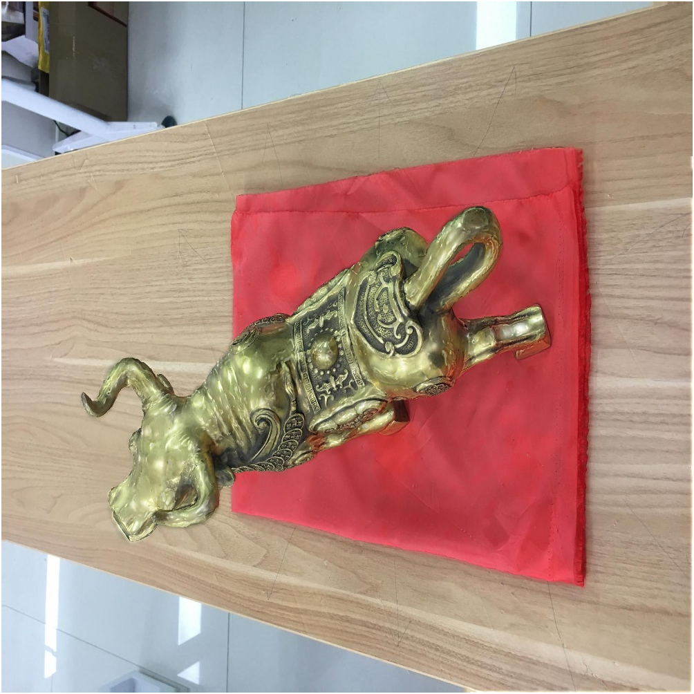
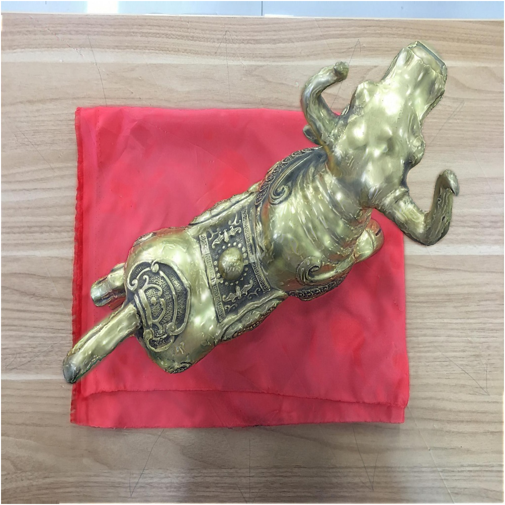
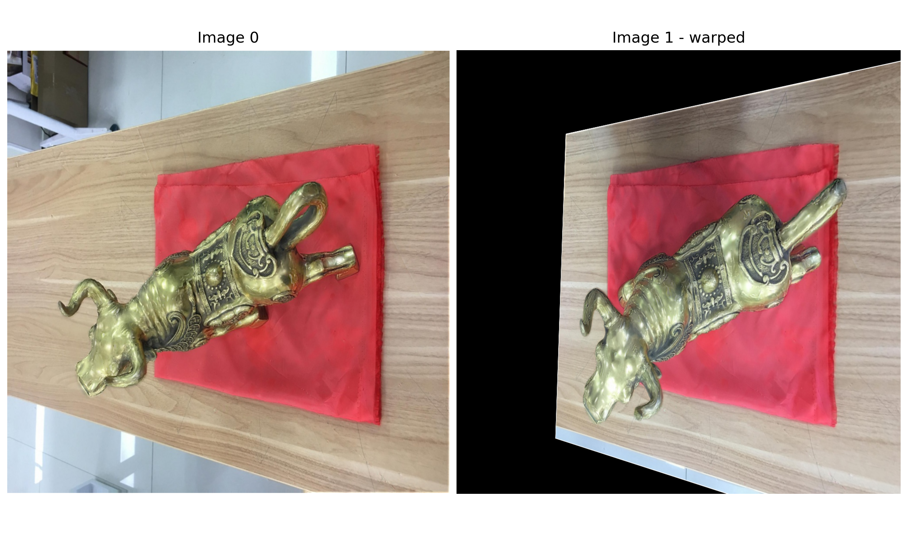
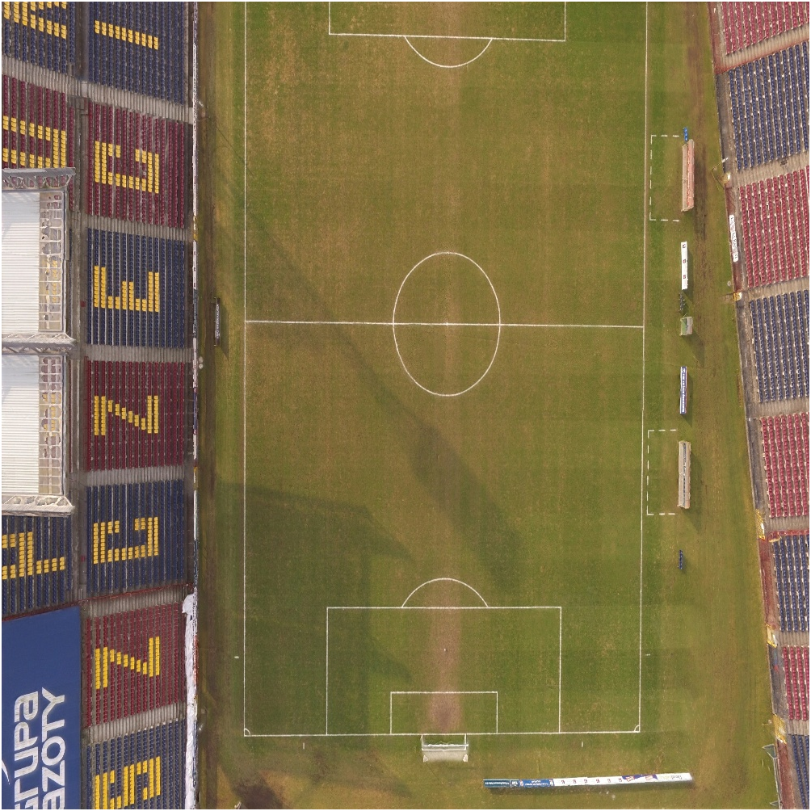
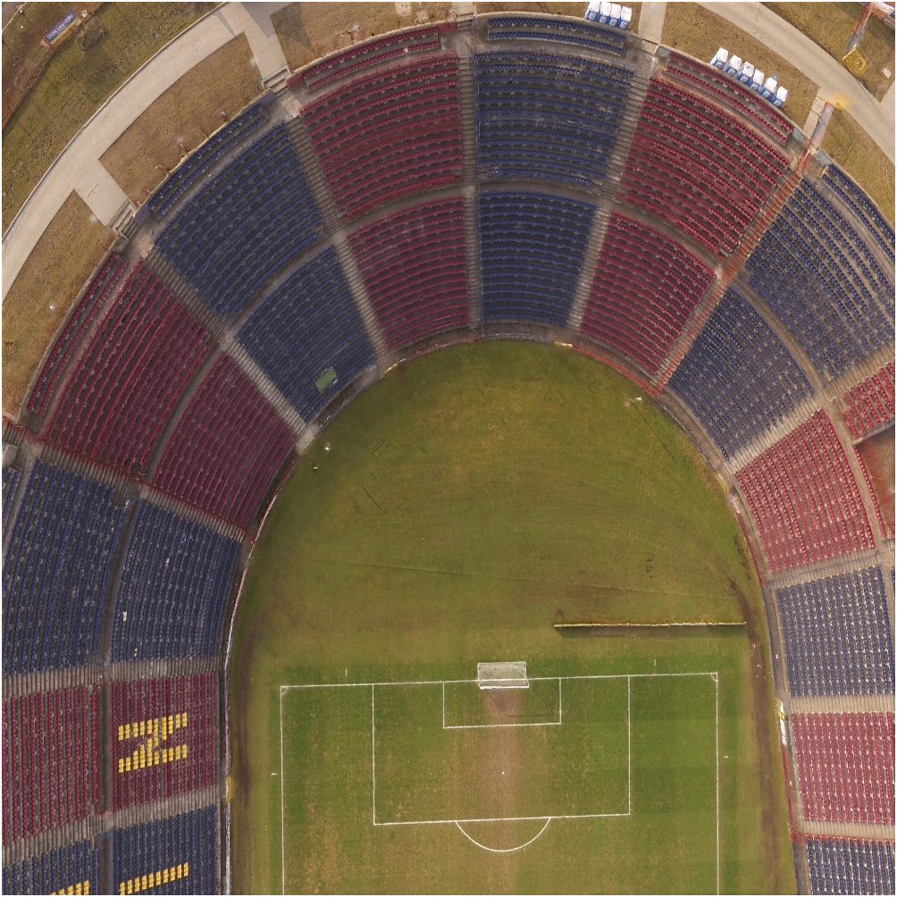
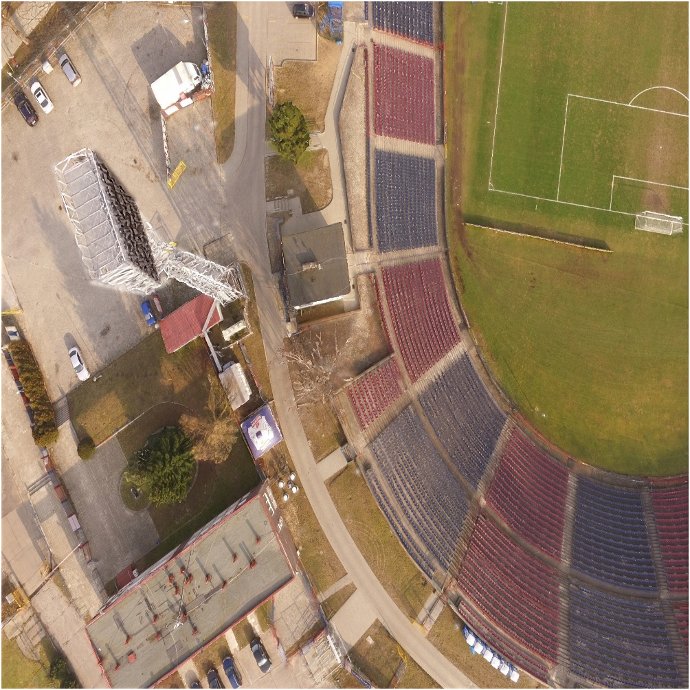
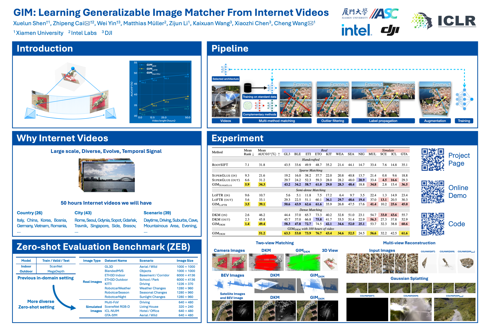

<p align="center">
  <a href="README.md"></a>
  <a href="README.zh-CN-simplified.md"></a>
</p>

<h2 align="center">GIM: Learning Generalizable Image Matcher From Internet Videos</h2>


<div align="center">
	<a href="https://www.youtube.com/embed/FU_MJLD8LeY">
		
	</a>
</div>
<p></p>

<div align="center">

<!-- <a href="https://iclr.cc/Conferences/2024"></a> -->
<a href="https://xuelunshen.com/gim"></a>
<a href="https://arxiv.org/abs/2402.11095"></a>
<a href="https://huggingface.co/spaces/xuelunshen/gim-online"></a>
<a href="https://www.youtube.com/watch?v=FU_MJLD8LeY"></a>
<a href="https://community.intel.com/t5/Blogs/Tech-Innovation/Artificial-Intelligence-AI/Intel-Labs-Research-Work-Receives-Spotlight-Award-at-Top-AI/post/1575985"></a>
<a href="https://zhuanlan.zhihu.com/p/711361901"></a>


<!-- <a href="https://xuelunshen.com/gim"></a> -->
<!-- <a href="https://xuelunshen.com/gim"></a> -->

<a href="https://en.xmu.edu.cn"></a>
<a href="https://www.intel.com"></a>
<a href="https://www.dji.com"></a>

</div>

## ✅ TODO List

- [x] **ZEB**: **Z**ero-shot **E**valuation **B**enchmark
- [ ] Inference code
  - [ ] gim_roma
  - [x] gim_dkm
  - [x] gim_loftr
  - [x] gim_lightglue
- [ ] Training code

> We are actively continuing with the remaining open-source work and appreciate everyone's attention.

## 🤗 Online demo

Go to [Huggingface](https://huggingface.co/spaces/xuelunshen/gim-online) to quickly try our model online.

## ⚙️ Environment

I set up the running environment on a new machine using the commands listed below.

<p></p>
<details>
<summary><b>[ Click to show commands ]</b></summary>

```bash
conda install pytorch==1.10.1 torchvision==0.11.2 torchaudio==0.10.1 cudatoolkit=11.3 -c pytorch -c conda-forge
pip install albumentations==1.0.1 --no-binary=imgaug,albumentations
pip install pytorch-lightning==1.5.10
pip install opencv-python==4.5.3.56
pip install imagesize==1.2.0
pip install kornia==0.6.10
pip install einops==0.3.0
pip install loguru==0.5.3
pip install joblib==1.0.1
pip install yacs==0.1.8
pip install h5py==3.1.0
```

</details>
<p></p>

## 🔨 Usage

1. Clone the repository

```bash
git clone https://github.com/xuelunshen/gim.git
cd gim
```

2. Download `gim_dkm` model weight from [Google Drive](https://drive.google.com/file/d/1gk97V4IROnR1Nprq10W9NCFUv2mxXR_-/view?usp=sharing) or [OneDrive](https://stuxmueducn-my.sharepoint.com/:u:/g/personal/xuelun_stu_xmu_edu_cn/EdJOibZ8VABOoKoyOHWo8ZEBHd_MyHbSvhRyT_o40SIPGA?e=GCjGZE)

3. Put it on the folder `weights`

4. Run the following commands

<p></p>
<details>
<summary><b>[ Click to show commands ]</b></summary>

```bash
python demo.py --model gim_dkm
```
or
```bash
python demo.py --model gim_loftr
```
or
```bash
python demo.py --model gim_lightglue
```

</details>
<p></p>


5. The code will match `a1.png` and `a2.png` in the folder `assets/demo`,</br>and output `a1_a2_match.png` and `a1_a2_warp.png`.

<details>
<summary>
<b>
	[ Click to show
	<code>a1.png</code>
	and
	<code>a2.png</code> ]
</b>
</summary>
<p float="left">
  
   
</p>
</details>


<details>
<summary>
<b>
	[ Click to show
	<code>a1_a2_match.png</code> ]
</b>
</summary>
<p align="left">
	
</p>
<p><code>a1_a2_match.png</code> is a visualization of the match between the two images</p>
</details>

<details>
<summary>
<b>
	[ Click to show
	<code>a1_a2_warp.png</code> ]
</b>
</summary>
<p align="left">
	
</p>
<p><code>a1_a2_warp.png</code> shows the effect of projecting <code>image a2</code> onto <code>image a1</code> using homography</p>
</details>

<p></p>
There are more images in the `assets/demo` folder, you can try them out.
<p></p>

<details>
<summary>
<b>
	[ Click to show other images ]
</b>
</summary>
<p float="left">
  
   
  
   
  
   
</p>
</details>

## 📊 ZEB: Zero-shot Evaluation Benchmark

1. Create a folder named **`zeb`**.
2. Download zip archives containing the **ZEB** data from [the URL](https://stuxmueducn-my.sharepoint.com/:f:/g/personal/lizijun_stu_xmu_edu_cn/EmHLjQpbpDRKmiED88rxGl4BFIkSp7vAzXifwXtvVbQA9w?e=ey8WVk), put it into the **`zeb`** folder and unzip zip archives.
3. Run the following commands

<p></p>
<details>
<summary><b>[ Click to show commands ]</b></summary>

The number **1** below represents the number of GPUs you want to use. If you want to use **2 GPUs**, change the number **1** to **2**.

```bash
sh TEST_GIM_DKM.sh 1
```
or
```bash
sh TEST_GIM_LOFTR.sh 1
```
or
```bash
sh TEST_GIM_LIGHTGLUE.sh 1
```
or
```bash
sh TEST_ROOT_SIFT.sh 1
```
</details>
<p></p>

4. Run the command `python check.py` to check if everything outputs `"Good"`.
5. Run the command `python analysis.py --dir dump/zeb --wid gim_dkm --version 100h --verbose` to get result.
6. Paste the **ZEB** result to the Excel file named `zeb.xlsx`.

<p></p>
<details>
<summary><b>[ Click to show ZEB Result ]</b></summary>

> The data in this table comes from the **ZEB**: <u>Zero-shot Evaluation Benchmark for Image Matching</u> proposed in the paper. This benchmark consists of 12 public datasets that cover a variety of scenes, weather conditions, and camera models, corresponding to the 12 test sequences starting from GL3 in the table.

|      | <div align="left">Method</div>                               | <div align="left">Mean<br />AUC@5°<br />(%) ↑</div> | GL3      | BLE      | ETI      | ETO      | KIT      | WEA      | SEA      | NIG      | MUL      | SCE      | ICL      | GTA      |
| ---- | ------------------------------------------------------------ | --------------------------------------------------- | -------- | -------- | -------- | -------- | -------- | -------- | -------- | -------- | -------- | -------- | -------- | -------- |
|      |                                                              | Handcrafted                                         |          |          |          |          |          |          |          |          |          |          |          |          |
|      | RootSIFT                                                     | 31.8                                                | 43.5     | 33.6     | 49.9     | 48.7     | 35.2     | 21.4     | 44.1     | 14.7     | 33.4     | 7.6      | 14.8     | 35.1     |
|      |                                                              | Sparse Matching                                     |          |          |          |          |          |          |          |          |          |          |          |          |
|      | [SuperGlue](https://github.com/magicleap/SuperGluePretrainedNetwork) (in) | 21.6                                                | 19.2     | 16.0     | 38.2     | 37.7     | 22.0     | 20.8     | 40.8     | 13.7     | 21.4     | 0.8      | 9.6      | 18.8     |
|      | SuperGlue (out)                                              | 31.2                                                | 29.7     | 24.2     | 52.3     | 59.3     | 28.0     | 28.4     | 48.0     | 20.9     | 33.4     | 4.5      | 16.6     | 29.3     |
|      | **GIM_SuperGlue**<br />(50h)                                 | 34.3                                                | 43.2     | 34.2     | 58.7     | 61.0     | 29.0     | 28.3     | 48.4     | 18.8     | 34.8     | 2.8      | 15.4     | 36.5     |
|      | [LightGlue](https://github.com/cvg/LightGlue)                | 31.7                                                | 28.9     | 23.9     | 51.6     | 56.3     | 32.1     | 29.5     | 48.9     | 22.2     | 37.4     | 3.0      | 16.2     | 30.4     |
| ✅    | **GIM_LightGlue**<br />(100h)                                | **38.3**                                            | **46.6** | **38.1** | **61.7** | **62.9** | **34.9** | **31.2** | **50.6** | **22.6** | **41.8** | **6.9**  | **19.0** | **43.4** |
|      |                                                              | Semi-dense Matching                                 |          |          |          |          |          |          |          |          |          |          |          |          |
|      | [LoFTR](https://github.com/zju3dv/LoFTR) (in)                | 10.7                                                | 5.6      | 5.1      | 11.8     | 7.5      | 17.2     | 6.4      | 9.7      | 3.5      | 22.4     | 1.3      | 14.9     | 23.4     |
|      | LoFTR (out)                                                  | 33.1                                                | 29.3     | 22.5     | 51.1     | 60.1     | **36.1** | **29.7** | **48.6** | **19.4** | 37.0     | **13.1** | 20.5     | 30.3     |
| ✅    | **GIM_LoFTR**<br />(50h)                                     | **39.1**                                            | **50.6** | **43.9** | **62.6** | **61.6** | 35.9     | 26.8     | 47.5     | 17.6     | **41.4** | 10.2     | **25.6** | **45.0** |
|      | **GIM_LoFTR**<br />(100h)                                    | ToDO                                                |          |          |          |          |          |          |          |          |          |          |          |          |
|      |                                                              | Dense Matching                                      |          |          |          |          |          |          |          |          |          |          |          |          |
|      | [DKM](https://github.com/Parskatt/DKM) (in)                  | 46.2                                                | 44.4     | 37.0     | 65.7     | 73.3     | 40.2     | 32.8     | 51.0     | 23.1     | 54.7     | 33.0     | **43.6** | 55.7     |
|      | DKM (out)                                                    | 45.8                                                | 45.7     | 37.0     | 66.8     | 75.8     | 41.7     | 33.5     | 51.4     | 22.9     | 56.3     | 27.3     | 37.8     | 52.9     |
|      | **GIM_DKM**<br />(50h)                                       | 49.4                                                | 58.3     | 47.8     | 72.7     | 74.5     | 42.1     | **34.6** | 52.0     | **25.1** | 53.7     | 32.3     | 38.8     | 60.6     |
| ✅    | **GIM_DKM**<br />(100h)                                      | **51.2**                                            | **63.3** | **53.0** | **73.9** | 76.7     | **43.4** | **34.6** | **52.5** | 24.5     | 56.6     | 32.2     | 42.5     | **61.6** |
|      | [RoMa](https://github.com/Parskatt/RoMa) (in)                | 46.7                                                | 46.0     | 39.3     | 68.8     | 77.2     | 36.5     | 31.1     | 50.4     | 20.8     | 57.8     | **33.8** | 41.7     | 57.6     |
|      | RoMa (out)                                                   | 48.8                                                | 48.3     | 40.6     | 73.6     | **79.8** | 39.9     | 34.4     | 51.4     | 24.2     | **59.9** | 33.7     | 41.3     | 59.2     |
|      | **GIM_RoMa**                                                 | ToDO                                                |          |          |          |          |          |          |          |          |          |          |          |          |

</details>
<p></p>

## 🖼️ Poster

<div align="center">
	<a href="https://www.youtube.com/embed/FU_MJLD8LeY">
		
	</a>
</div>

## 📌 Citation

If the paper and code from `gim` help your research, we kindly ask you to give a citation to our paper ❤️. Additionally, if you appreciate our work and find this repository useful, giving it a star ⭐️ would be a wonderful way to support our work. Thank you very much.

```bibtex
@inproceedings{
xuelun2024gim,
title={GIM: Learning Generalizable Image Matcher From Internet Videos},
author={Xuelun Shen and Zhipeng Cai and Wei Yin and Matthias Müller and Zijun Li and Kaixuan Wang and Xiaozhi Chen and Cheng Wang},
booktitle={The Twelfth International Conference on Learning Representations},
year={2024}
}
```

## 🌟 Star History

<a href="https://star-history.com/#xuelunshen/gim&Date">
  <picture>
    <source media="(prefers-color-scheme: dark)" srcset="https://api.star-history.com/svg?repos=xuelunshen/gim&type=Date&theme=dark" />
    <source media="(prefers-color-scheme: light)" srcset="https://api.star-history.com/svg?repos=xuelunshen/gim&type=Date" />
    
  </picture>
</a>

## License

This repository is under the MIT License. This content/model is provided here for research purposes only. Any use beyond this is your sole responsibility and subject to your securing the necessary rights for your purpose. 
